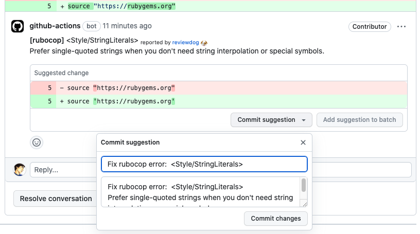

# Reviewdog Rubocop Auto Suggestion

This Chrome Extension automatically fill the title and body of suggestions provided by [reviewdog/action-rubocop](https://github.com/reviewdog/action-rubocop).



It works only if you enable [reviewdog/action-rubocop](https://github.com/reviewdog/action-rubocop) with 'github-pr-review' reporter option.

Here is a example configuration of Github Actions.

```
- name: rubocop
  uses: reviewdog/action-rubocop@v2
  with:
    rubocop_version: gemfile
    reporter: github-pr-review
```

## How to install

Please follow these steps:

1. Download the extension's source code:

- Click the green "Code" button near the top right corner of this page.
- Download the ZIP file by clicking "Download ZIP".
- Extract the contents of the ZIP file to a folder on your local computer.

2. Enable Developer mode in Google Chrome:

- Open Google Chrome.
- Click the three-dot menu icon in the top-right corner and select "More tools" > "Extensions".
- Enable the "Developer mode" toggle switch in the top right corner of the Extensions page.

3. Load the unpacked extension:

- Click the "Load unpacked" button in the top-left corner of the Extensions page.
- Browse to the folder where you extracted the extension's source code in step 1.
- Select the folder and click "Open" or "Select Folder" (depending on your operating system).

The extension should now be installed and appear in the list of installed extensions. You can enable or disable it using the toggle switch next to the extension's name: "Reviewdog Rubocop Auto Suggestion".

Please see [Loading an unpacked extension](https://developer.chrome.com/docs/extensions/mv3/getstarted/development-basics/#load-unpacked) of Chrome Extension development basics page for more detail.
